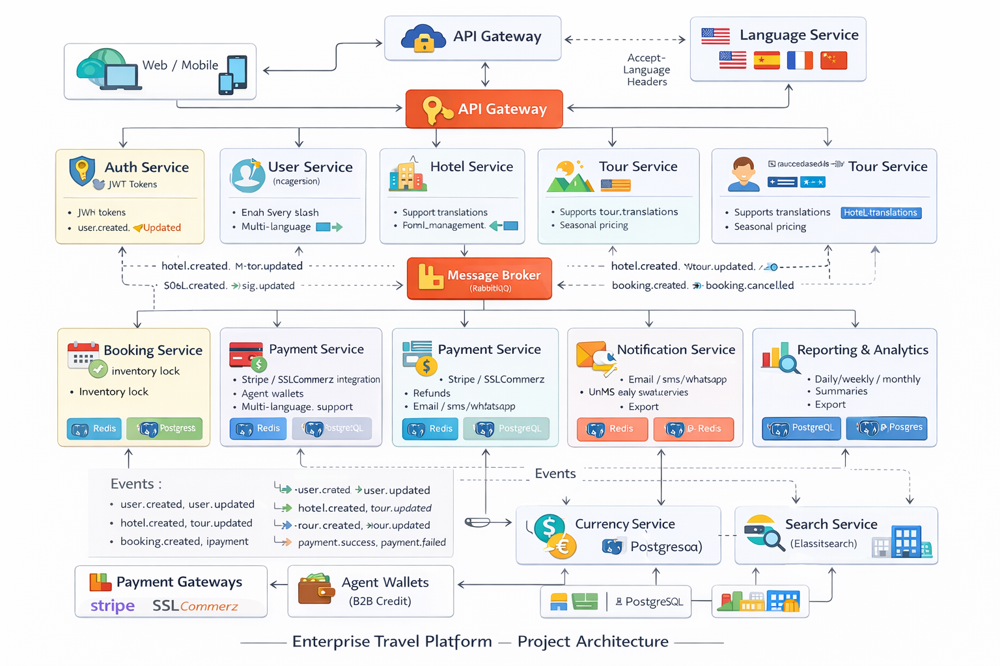

# Nest Microservices Monorepo

This repository contains the microservices for the Enterprise Travel Platform.



Quick start:

```bash
bun install
bun run start:dev:api-gateway
```

Each service has a health endpoint at `/health`.
